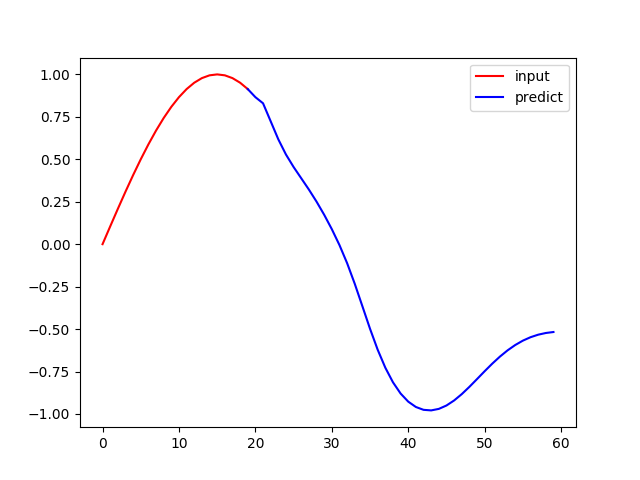
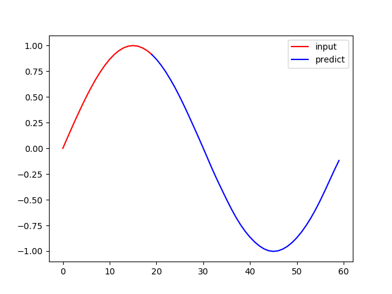
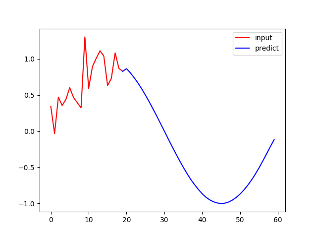

# seq2seq
seq2seqで正弦波を予測してみた

## 実行例
```bash
python train.py in20_out40 --input_len 20 --output_len 40
```
長さ20の正弦波から長さ40の正弦波を予測する(epoch数は100)



___

```bash
python train.py in20_out40_epochs_1000 --input_len 20 --output_len 40 --epochs 1000
```
epoch数を1000回に増やしてみた



___

```bash
python train.py in20_out40_epochs_500_noise --input_len 20 --output_len 40 --epochs 500 --noise
```
入力にノイズありの正弦波



## 参考
https://github.com/bentrevett/pytorch-seq2seq/blob/master/1%20-%20Sequence%20to%20Sequence%20Learning%20with%20Neural%20Networks.ipynb
